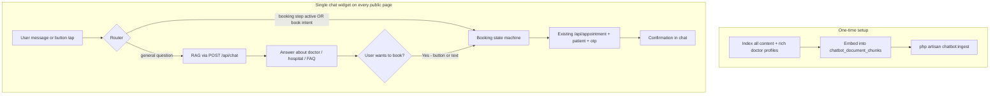
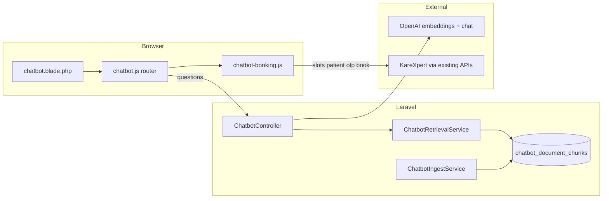
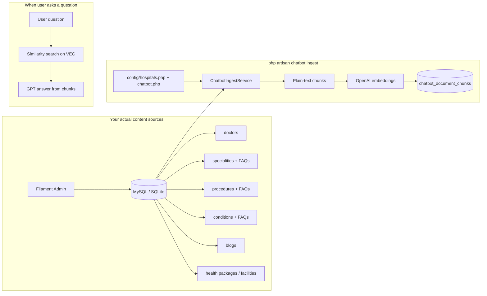
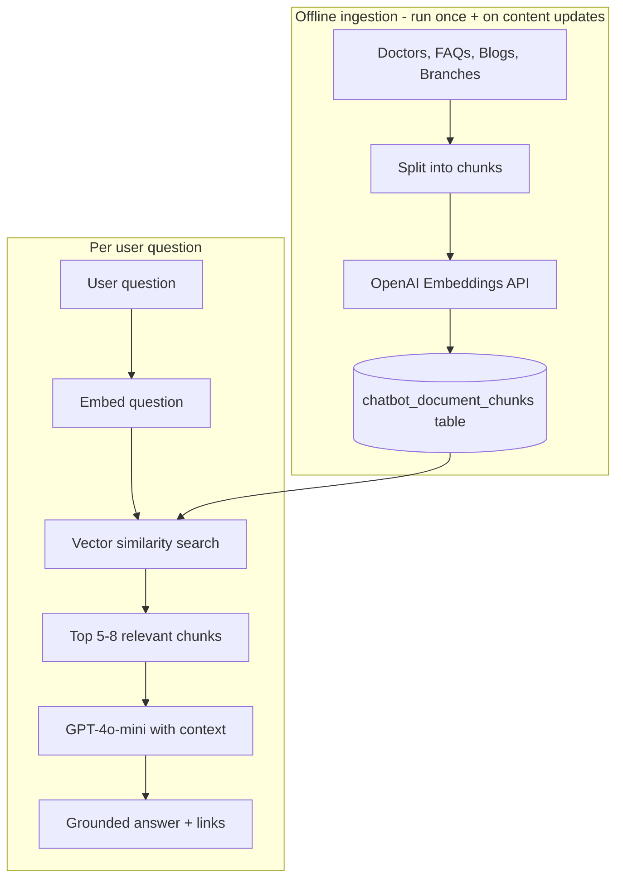
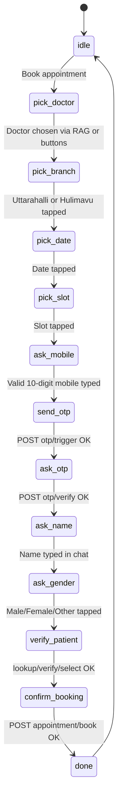

# AI Chatbot for Nano Hospitals — Recommended unified approach

## Your requirements (summary)

1. Site-wide chatbot on all public pages  
2. **RAG** — accurate answers from your real content, not AI guesses  
3. **Doctor Q&A** — qualifications, experience, speciality, location, what they treat, etc.  
4. **Conversational booking** — bot asks for mobile, OTP, name, slot; user never fills a form  
5. **One chat** — ask about a doctor, then book with them, without leaving the panel  

## Recommended approach: unified dual-mode chat

Use **one chat widget** with a **message router** that sends each user input to either RAG (questions) or the booking state machine (appointment steps). Do not build two separate bots.



### Why this approach

| Decision | Recommendation | Why |
|----------|----------------|-----|
| Retrieval | Full RAG (embeddings + chunks table) | Doctor questions need semantic search; keyword search misses "heart doctor" → Cardiology |
| Doctor content | **Multiple chunks per doctor** (bio, qualifications, experience, speciality, location) | One chunk per doctor is too thin for rich Q&A |
| Booking UI | Conversational state machine in JS | Matches your requirement — no forms, only chat + buttons |
| Booking backend | Reuse existing `/api/*` routes | KareXpert logic already works; don't duplicate |
| AI provider | OpenAI `text-embedding-3-small` + `gpt-4o-mini` | Cheap, simple HTTP calls, no extra packages |
| Vector store | JSON column in MySQL/SQLite | Your dataset is small; no Pinecone/Qdrant needed yet |
| Intent routing | Server returns `intent` + `actions` from `/api/chat` | Bot can answer about Dr Mohan AND offer `[Book with Dr Mohan]` in same reply |
| During booking | Pause RAG; route all input to state machine | Prevents "9876543210" being sent to OpenAI as a question |

### What NOT to do

- Do not open the existing appointment modal or redirect to doctor checkout pages  
- Do not use Meilisearch alone for chat (keep it for the site search bar only)  
- Do not let GPT call booking APIs directly (use your validated Laravel endpoints from JS)  
- Do not skip OTP if you want parity with the checkout flow  

---

## One complete user flow (Q&A + booking together)

```
─── START ───
User opens chat on any page (homepage, why-nano, doctors, etc.)

Bot:  Hi! I'm Nano Assistant. Ask me about our doctors, specialities,
      or branches — or book an appointment.
      [Book appointment]  [Find a doctor]  [Branch info]

─── PATH A: Ask about a doctor (RAG) ───

User: Tell me about Dr Mohan M R

Bot:  (RAG retrieves doctor chunks)
      Dr Mohan M R is a senior cardiologist with X years of experience.
      Qualification: MD, DM Cardiology. Practices at BG Road (Hulimavu).
      [Book with Dr Mohan]  [Other cardiologists]

User: What conditions does he treat?

Bot:  (RAG retrieves speciality + doctor chunks)
      He treats coronary artery disease, heart failure, arrhythmias...
      [Book with Dr Mohan]

User: (taps Book with Dr Mohan)
      → Router switches to booking mode, doctor pre-selected

─── PATH B: Direct booking ───

User: (taps Book appointment)

Bot:  Which doctor would you like to see?
      [Dr Mohan - Cardiology]  [Dr Priya - Ortho]  [Search by speciality...]

User: (taps Dr Mohan)   OR   User: "cardiologist" → RAG suggests doctors

─── BOOKING (same for A and B) ───

Bot:  Which branch?  [Uttarahalli]  [Hulimavu / BG Road]
User: (taps Hulimavu)

Bot:  Pick a date:  [Today]  [Tomorrow]  [Wed 8 Jul] ...
User: (taps Tomorrow)

Bot:  Available slots for Dr Mohan:
      [10:30 AM]  [11:00 AM]  [2:30 PM]
User: (taps 10:30 AM)

Bot:  Enter your 10-digit mobile number.
User: 9876543210

Bot:  OTP sent to 9876543210. Enter the 6-digit code.  [Resend OTP]
User: 482910

Bot:  What is the patient's full name?
User: Rajesh Kumar

Bot:  Select gender:  [Male]  [Female]  [Other]
User: (taps Male)

Bot:  Booking your appointment...
Bot:  Done! Rajesh Kumar · Dr Mohan · 10:30 AM tomorrow · Ref: APT12345
      [Ask another question]

─── Back to Q&A ───
Booking state resets to idle; user can ask more questions via RAG.
```

---

## Build order (do in this sequence)

| Phase | What | Outcome |
|-------|------|---------|
| **1** | Config, migration, `ChatbotIngestService`, `chatbot:ingest` | All doctors + hospital content indexed |
| **2** | `ChatbotRetrievalService`, `ChatbotService`, `POST /api/chat` | Bot answers doctor/hospital questions |
| **3** | `chatbot.blade.php` + `chatbot.js`, add to layout | Widget live on all pages |
| **4** | Intent + `suggested_actions` in chat API (`book_doctor`, `start_booking`) | "Book with Dr X" buttons after Q&A |
| **5** | `chatbot-booking.js` state machine + wire all booking APIs | Full booking in chat with OTP |
| **6** | Test end-to-end, mobile layout, guardrails | Ship |

**Estimated effort:** 3–4 days for one developer familiar with this Laravel codebase.

**Prerequisites you need:** OpenAI API key with billing, Meilisearch running (unchanged), SMS/OTP provider working (your `OtpService` already exists — codes may log locally until SMS is wired).

---

## Doctor Q&A — ingest strategy (important)

To answer "everything about the doctor", ingest **separate chunks per doctor**:

| Chunk | Content | Metadata |
|-------|---------|----------|
| Profile | name, designation, qualification, experience_years | `source_type: doctor`, `slug`, `practitioner_id` |
| About | `about` field (stripped HTML) | same |
| Speciality link | speciality name + what they treat | `speciality_slug` |
| Location | branch / location field | `location: Hulimavu` |
| Booking | "Book appointments with {name}" | `practitioner_id` for slot API |

When user asks about a doctor, RAG returns these chunks → GPT composes a natural answer → response includes `actions: [{ type: "book_doctor", slug, practitioner_id }]`.

---

## Technical architecture (one diagram)



---

## Where RAG content comes from (no PDF, no crawling)

**Short answer:** You do **not** need a PDF and you do **not** need to crawl the website. Your content already lives in the **Laravel database** (managed via Filament admin). The ingest command reads from the DB, chunks it, embeds it, and stores it in `chatbot_document_chunks`.



### Why not crawl the website?

| Crawling | Reading from DB (recommended) |
|----------|-------------------------------|
| Scrapes rendered HTML — messy nav, footers, duplicate text | Clean fields: `doctor.about`, `qualification`, FAQ question/answer |
| Breaks when you change blade layout | Stable — reads model attributes |
| Misses data not visible on page | Gets everything in Filament, including fields not shown on frontend |
| Needs re-crawl on every deploy | Re-ingest on save or `chatbot:ingest` after admin edits |
| You already own the source of truth | **DB is the source of truth** |

Crawling is for external sites or legacy HTML with no CMS. You have Filament + Eloquent — use that.

### Why not a PDF?

A PDF is only useful if important content exists **only** in a brochure and nowhere in the admin or on the site. For Nano Hospitals, doctor profiles, specialities, procedures, and FAQs are already in the DB. No PDF required for MVP.

Optional later: upload PDFs in Filament and parse them — not needed to start.

### What gets ingested (concrete)

| Source | How ingest reads it | Example chat question it answers |
|--------|---------------------|--------------------------------|
| `Doctor` model | `$doctor->name`, `qualification`, `designation`, `about`, `experience_years`, `speciality`, `location`, `practitioner_id` | "Tell me about Dr Mohan" / "Who is a cardiologist?" |
| `Speciality` + `SpecialityFaq` | Content fields + FAQ pairs | "What is cardiology treatment like?" |
| `Procedure` + `ProcedureFaq` | `title`, `introduction`, FAQs | "How is knee replacement done?" |
| `Condition` + `ConditionFaq` | Name, content, FAQs | "What are symptoms of diabetes?" |
| `Blog` | Title, body | "Latest health articles" |
| `HealthPackage` | Name, description | "What health checkup packages do you have?" |
| `HealthFacilityPage` | Content, FAQs | "What facilities are at the hospital?" |
| `config/hospitals.php` + chatbot config | Branch addresses, phone, WhatsApp | "Where is Uttarahalli branch?" |

### Static blade pages (homepage, about, why-nano, branches)

These pages are **hardcoded in `resources/views/`**, not in Filament. They matter for *"Why choose Nano?"*, *"Tell me about the hospital"*, branch details, international patients, etc.

**Do not crawl the live site.** Ingest them during `php artisan chatbot:ingest` alongside DB content.

#### Three tiers (all ingested together)

| Tier | Source | What | How |
|------|--------|------|-----|
| **1 — Database** | Filament | Doctors, specialities, procedures, FAQs, blogs | Eloquent |
| **2 — Config** | `config/hospitals.php`, `config/chatbot.php` | Addresses, phone, WhatsApp, emergency | Static strings |
| **3 — Static blades** | `resources/views/*.blade.php` | about, why-nano, branch pages | Render → strip HTML → chunk |

#### Static pages to include in ingest

| Page | Blade file | Route | Variables needed? |
|------|------------|-------|-----------------|
| Why Nano | `why-nano.blade.php` | `/why-nano` | No — full ingest |
| About | `about.blade.php` | `/about` | No |
| BG Road | `hulimavu.blade.php` | `/bg-road` | No |
| Uttarahalli | `uttarahalli.blade.php` | `/uttarahalli` | No |
| Second opinion | `second-opinion.blade.php` | `/second-opinion` | No |
| International patients | `international-patients.blade.php` | `/international-patients` | No |
| Careers | `career.blade.php` | `/careers` | No |
| Homepage | `welcome.blade.php` | `/` | **Partial** — see below |

#### How Tier 3 ingest works

`ChatbotIngestService::ingestStaticPages()`:

1. Read page list from `config/chatbot.php` → `static_pages` (`view`, `url`, `title`)
2. Render: `View::make('why-nano')->render()` (works for pages with no `$variables`)
3. Strip HTML/scripts → plain text
4. Chunk (~500 words), embed, store with `source_type: static_page`, `url: /why-nano`

When you edit `why-nano.blade.php`, re-run `php artisan chatbot:ingest`.

#### Homepage special case

`welcome.blade.php` is huge and mixes **static marketing** with **dynamic doctor cards** (`$featuredDoctors`).

- **Dynamic doctors** → already ingested from `Doctor` model (don't duplicate)
- **Static marketing** (NABH, 24x7 emergency, hospital story) → ingest from:
  - `meta_description` + JSON-LD schema already in the blade, and/or
  - a short `homepage_summary` in `config/chatbot.php`

Do **not** render the full homepage with all loops — avoids duplicate doctor chunks.

#### Maintenance

| You change… | Action |
|-------------|--------|
| Doctor in Filament | Auto re-embed doctor |
| `why-nano.blade.php` | `php artisan chatbot:ingest` |
| New static page | Add to `config/chatbot.php` `static_pages` |

No PDF. No live crawling.

### How chunking works (step by step)

1. **Load** — `Doctor::with('speciality')->get()` (and other models)  
2. **Build text** — e.g. `"Dr Mohan M R | MD, DM Cardiology | 15 years experience | Cardiology | Hulimavu | {about text}"`  
3. **Split** — long `about` or speciality pages → ~500-word chunks with overlap  
4. **Metadata** — attach `slug`, `practitioner_id`, `url`, `source_type` on each chunk  
5. **Embed** — send each chunk to OpenAI `text-embedding-3-small` → vector array  
6. **Store** — save `content`, `embedding`, `metadata` in `chatbot_document_chunks`  
7. **Refresh** — run `php artisan chatbot:ingest` after bulk imports, or auto re-embed when a doctor is saved in Filament  

### How a user question flows (at runtime)

1. User: *"What is Dr Mohan's qualification?"*  
2. Embed the question (same embedding model)  
3. Compare to all stored chunk vectors → top 6–8 matches (doctor profile chunks)  
4. Send those chunks + question to GPT-4o-mini: *"Answer only from this context"*  
5. Bot: *"Dr Mohan M R holds MD, DM Cardiology..."* + `[Book with Dr Mohan]`  

No PDF opened. No page crawled. Vectors matched against DB-derived chunks.

### When content updates

| Event | What to do |
|-------|------------|
| Admin edits a doctor in Filament | Model observer re-embeds that doctor's chunks (or nightly `chatbot:ingest`) |
| New speciality / FAQ added | Same |
| New static page content | Add to ingest list or copy key text into config |
| New PDF brochure | Optional future: PDF parser — not MVP |

---

## Original RAG pipeline details

Build a **custom AI assistant** with a proper **RAG (Retrieval-Augmented Generation)** pipeline. Instead of relying on keyword search or the model's general knowledge, the bot:

1. **Ingests** your hospital content into searchable chunks
2. **Embeds** each chunk as a vector (meaning-based representation)
3. **Retrieves** the most relevant chunks when a user asks a question
4. **Generates** an answer grounded only in those retrieved chunks

This reduces hallucinations ("made up" doctors or wrong addresses) and lets the bot understand natural language like "heart specialist in Hulimavu" even if the page says "Cardiology".



## RAG vs keyword search (why RAG is better here)

| | Keyword search (Meilisearch only) | Full RAG |
|--|-----------------------------------|----------|
| "heart doctor" → Cardiology | May miss if word "heart" isn't on page | Works — embeddings understand meaning |
| Long speciality pages | Returns whole page, may overflow token limit | Returns only the relevant paragraph |
| FAQs across many models | Hard to search all FAQ tables at once | All FAQs chunked into one index |
| Answer accuracy | Model may fill gaps from general knowledge | Model instructed to use retrieved chunks only |
| Setup effort | Lower | Higher (ingest pipeline + vector store) |

**Recommendation for Nano Hospitals:** Use full RAG. Your content is structured (doctors, specialities, FAQs) and accuracy matters for healthcare. Dataset size (~hundreds to low thousands of chunks) is small enough to run without a separate vector database service.

## Why this fits your codebase

- All 28 public pages extend `layouts.app` — one component inclusion covers the whole site
- Rich content already in DB: Doctors (`about`, `qualification`), Specialities (many HTML content fields), Procedures, Conditions, Blogs, Health Packages, Health Facilities
- FAQ data in `SpecialityFaq`, `ProcedureFaq`, `ConditionFaq`, `HealthFacilityPage.faqs`
- Branch addresses in [`config/hospitals.php`](config/hospitals.php)
- Existing Meilisearch/Scout is for the site search bar — RAG uses a **separate vector index** optimized for chat context (semantic, chunked)

## RAG pipeline details

### Step 1 — Ingest (what content to index)

| Source | Fields to chunk | Example metadata |
|--------|-----------------|------------------|
| `Doctor` | name, qualification, designation, about, speciality name, location | `url: /doctors/{slug}`, `type: doctor` |
| `Speciality` | about_intro, about_more, overview, treatments, FAQs | `url: /specialities/{slug}` |
| `Procedure` | title, introduction, FAQs | `url: /procedures/{slug}` |
| `Condition` | name, content fields, FAQs | `url: /conditions/{slug}` |
| `Blog` | title, body excerpt | `url: /blog/{slug}` |
| `HealthPackage` | name, description | `url: /health-packages/{slug}` |
| `HealthFacilityPage` | hero_title, content, FAQs | `url: /health-facilities/{slug}` |
| Static | branch addresses, phone, WhatsApp, booking URL | `type: contact` |

**Chunking rules:** ~500 tokens per chunk, 100-token overlap, strip HTML to plain text. Each chunk stores `source_type`, `source_id`, `title`, `content`, `url`.

### Step 2 — Embed (vector store)

- Call OpenAI **`text-embedding-3-small`** (~$0.02/1M tokens — very cheap for your dataset size)
- Store embeddings in a new `chatbot_document_chunks` table (JSON column for the vector — no extra infra needed at your scale)
- Artisan command: `php artisan chatbot:ingest` (full reindex) + model observers to re-embed on Filament save

**Why not Meilisearch for vectors?** You could use Meilisearch hybrid search later, but a dedicated chunks table gives full control over chunking, metadata, and re-ingestion without touching the existing site search index.

### Step 3 — Retrieve (per question)

1. Embed the user's question with the same embedding model
2. Cosine similarity against all chunks (fast enough for <5,000 chunks in PHP/MySQL)
3. Return top **6–8 chunks** above a similarity threshold (e.g. 0.7)
4. Deduplicate by source URL; prefer FAQ and doctor chunks for direct questions

### Step 4 — Generate

System prompt instructs GPT-4o-mini to:
- Answer **only** from retrieved chunks
- Cite page links when mentioning doctors/specialities (`[Dr. X](/doctors/slug)`)
- Refuse diagnosis; redirect emergencies
- Say "I don't have that information" if chunks are irrelevant

## Files to create

| File | Purpose |
|------|---------|
| [`config/chatbot.php`](config/chatbot.php) | Enable flag, models, chunk size, top-K, system prompt, contact info |
| [`database/migrations/..._create_chatbot_document_chunks_table.php`](database/migrations) | `content`, `embedding` (json), `source_type`, `source_id`, `title`, `url` |
| [`app/Models/ChatbotDocumentChunk.php`](app/Models/ChatbotDocumentChunk.php) | Eloquent model for chunks |
| [`app/Services/ChatbotIngestService.php`](app/Services/ChatbotIngestService.php) | Chunk content from all models, call embeddings API, upsert chunks |
| [`app/Services/ChatbotRetrievalService.php`](app/Services/ChatbotRetrievalService.php) | Embed query, similarity search, return ranked chunks |
| [`app/Services/ChatbotService.php`](app/Services/ChatbotService.php) | Assemble RAG prompt + OpenAI chat completion |
| [`app/Console/Commands/IngestChatbotDocuments.php`](app/Console/Commands/IngestChatbotDocuments.php) | `php artisan chatbot:ingest` |
| [`app/Http/Controllers/ChatbotController.php`](app/Http/Controllers/ChatbotController.php) | Validate request, orchestrate retrieve + generate |
| [`resources/views/components/chatbot.blade.php`](resources/views/components/chatbot.blade.php) | Floating bubble + chat panel UI |
| [`resources/js/chatbot.js`](resources/js/chatbot.js) | Open/close panel, send messages, render history |

## Files to modify

| File | Change |
|------|--------|
| [`resources/views/layouts/app.blade.php`](resources/views/layouts/app.blade.php) | Add `<x-chatbot />` after other global widgets |
| [`resources/js/app.js`](resources/js/app.js) | Import `chatbot.js` |
| [`routes/api.php`](routes/api.php) | Add `POST /api/chat` with throttle (e.g. 20/min) |
| [`.env.example`](.env.example) | Document `OPENAI_API_KEY`, `CHATBOT_ENABLED` |

## Backend details

**API endpoint:** `POST /api/chat`

```json
{ "message": "Who is the best cardiologist?", "history": [{"role":"user","content":"..."},{"role":"assistant","content":"..."}] }
```

**RAG retrieval** (in `ChatbotRetrievalService`):
- Embed user message via OpenAI embeddings endpoint
- Load chunks from `chatbot_document_chunks`, compute cosine similarity
- Return top-K chunks formatted as context blocks with `[Source: title](url)`

**System prompt** (in `config/chatbot.php`):
- Role: Nano Hospitals website assistant
- Rules: answer only from provided context; if unsure, suggest booking appointment, calling, or WhatsApp; never give medical diagnosis or prescribe treatment; for emergencies, direct to ER/call immediately
- Include contact numbers and branch info

**OpenAI call** via Laravel `Http::withToken()` — no extra Composer package needed:

```php
Http::timeout(30)->withToken(config('services.openai.key'))
    ->post('https://api.openai.com/v1/chat/completions', [
        'model' => 'gpt-4o-mini',
        'messages' => [...],
        'max_tokens' => 500,
    ]);
```

Add `services.openai.key` to [`config/services.php`](config/services.php).

**Safety:**
- API key stays server-side only
- Rate limit the endpoint (`throttle:20,1`)
- Validate message length (max ~500 chars)
- `CHATBOT_ENABLED=false` hides widget and returns 503 from API

## Frontend UI

New `<x-chatbot />` component styled to match the site (Montserrat, red `#ef4444` / brand orange, rounded corners, Font Awesome icons).

**Layout positioning** (avoid overlap with existing widgets):

| Widget | Position |
|--------|----------|
| Mobile action bar | `bottom-0`, full width |
| Scroll-to-top + search | `bottom-22 right-6` |
| Desktop floating contact | `right-0`, vertically centered |
| **Chatbot bubble** | `fixed bottom-24 left-6 z-[55] md:bottom-10 md:left-6` |

Placing the chat bubble on the **bottom-left** keeps it clear of the right-side scroll/search/contact cluster.

**UI features (MVP):**
- Collapsed: round chat icon with "Ask Nano" label on hover
- Expanded: 360px tall panel with message list, **single chat input**, send button
- **No form fields** inside the panel — no `<input>` for name/mobile/OTP/slots; bot asks questions as messages, user answers by typing in the one chat box or tapping inline buttons
- Welcome quick-replies: "Book appointment", "Find a doctor", "Branch locations", "Emergency?"
- During booking: structured choices (branch, date, slot, gender, doctor) render as **tap buttons** inside the chat thread; free-text steps (name, mobile, OTP) use the **same chat input**
- Typing indicator while waiting for API
- Conversation + booking state in `sessionStorage`
- `data-track="chatbot"` for GA

## Environment setup (manual step for you)

Add to `.env`:

```
CHATBOT_ENABLED=true
OPENAI_API_KEY=sk-...
CHATBOT_EMBEDDING_MODEL=text-embedding-3-small
CHATBOT_CHAT_MODEL=gpt-4o-mini
```

You will need an [OpenAI API key](https://platform.openai.com/api-keys) with billing enabled.

**One-time setup after deploy:**
```bash
php artisan migrate
php artisan chatbot:ingest   # indexes all content (~2-5 min first run)
```

Re-run `chatbot:ingest` after bulk content updates in Filament, or rely on model observers for single-record edits.

**Estimated cost:** Ingestion is a one-time ~$0.05–0.50 depending on content volume. Per chat message: ~$0.001–0.003 (embedding + GPT-4o-mini).

## Out of scope (can add later)

- pgvector / Qdrant / Pinecone (only needed if chunks exceed ~10k)
- Meilisearch hybrid search as retrieval fallback
- Storing chat logs in admin/Filament
- Streaming responses (SSE)
- Hand-off to existing appointment modal or doctor page forms (booking stays 100% in chat)
- Admin panel chatbot toggle in Filament

## Testing checklist

- `php artisan chatbot:ingest` completes and populates chunks table
- Widget appears on homepage, `/why-nano`, `/doctors`; not on `/admin`
- Ask "What are your branch addresses?" — grounded answer from contact chunks
- Ask "Who treats heart problems?" — retrieves cardiology-related chunks (semantic, not keyword)
- Ask about a specific doctor — answer includes link to their profile
- Ask medical diagnosis question — bot refuses and suggests consulting a doctor
- Ask something not in your content — bot says it doesn't know, suggests calling
- Rate limit works after rapid messages
- Mobile: chat panel doesn't hide behind bottom action bar
- After editing a doctor in Filament, their chunk updates on save
- **Full booking in chat:** user completes name → mobile → slot → OTP → confirmation without leaving chat or filling any forms
- OTP resend works from a "Resend OTP" button in chat
- Invalid mobile/name/OTP shows bot error message and re-asks the same step

## Appointment booking — fully conversational (required)

**Requirement:** The user must **never fill a separate form**. No appointment modal, no doctor page widget, no checkout page. The bot asks each question as a chat message; the user answers by **typing in the chat input** (name, mobile, OTP) or **tapping buttons** (doctor, branch, date, slot, gender). The entire booking completes inside the chat panel.

### Existing APIs to reuse (no new KareXpert logic)

| API | When chat uses it |
|-----|-------------------|
| `GET /api/appointment/slots` | After branch + date chosen → bot shows slot buttons |
| `POST /api/patient/lookup` | After mobile entered in chat |
| `POST /api/patient/verify` | After name + gender collected |
| `POST /api/patient/select` | If multiple patients on same mobile → bot shows selection buttons |
| `POST /api/otp/trigger` | After mobile validated → send OTP SMS |
| `POST /api/otp/verify` | User types OTP in chat input |
| `POST /api/appointment/book` | After OTP verified + patient confirmed |

Reference: [`appointment-booking.blade.php`](resources/views/doctors/partials/appointment-booking.blade.php) and [`book-clinic-checkout.blade.php`](resources/views/doctors/book-clinic-checkout.blade.php) for API payloads — logic moves into `chatbot.js` + optional `ChatbotBookingService` on backend.

### Conversational flow (state machine)



**What the user sees (example):**

```
Bot:  Which doctor would you like to see?
      [Dr Mohan M R - Cardiology] [Dr Priya - Ortho] [Search more...]

User: (taps Dr Mohan)

Bot:  Which branch?
      [Uttarahalli] [Hulimavu / BG Road]

User: (taps Hulimavu)

Bot:  Pick a date:
      [Today 6 Jul] [Tomorrow] [Wed 8 Jul] ...

User: (taps Tomorrow)

Bot:  Available slots for Dr Mohan:
      [10:30 AM] [11:00 AM] [2:30 PM]

User: (taps 10:30 AM)

Bot:  Please enter your 10-digit mobile number.

User: 9876543210

Bot:  We've sent a 6-digit OTP to 9876543210. Please enter it here.
      [Resend OTP]

User: 482910

Bot:  What is the patient's full name?

User: Rajesh Kumar

Bot:  Please select gender:
      [Male] [Female] [Other]

User: (taps Male)

Bot:  Booking your appointment...

Bot:  Done! Appointment confirmed for Rajesh Kumar · 10:30 AM · Ref: APT12345
```

### UI rules (no forms)

| Step | User input method | NOT allowed |
|------|-------------------|-------------|
| Doctor / branch / date / slot / gender | Tap buttons in chat thread | Dropdowns, date pickers, form fields |
| Mobile | Type in chat input | Separate phone input field |
| OTP | Type 6 digits in chat input | OTP input box |
| Name | Type in chat input | Name input field |

While `bookingState.step !== 'idle'`, the chat input handler validates the message against the **current step** (e.g. only digits for mobile/OTP, min 2 chars for name) instead of sending to RAG. A "Cancel booking" button resets state.

### Backend options

**Option A (recommended):** `chatbot.js` calls existing `/api/*` routes directly — same as doctor page, no new Laravel endpoints for booking.

**Option B:** Single `POST /api/chat/booking-step` that orchestrates server-side — more control but duplicates existing controller logic. Avoid unless you need server-side session security.

### RAG role during booking

- **Before booking starts:** RAG finds doctors/specialities ("I need a cardiologist" → doctor buttons)
- **During booking:** State machine takes over — messages route to booking handler, not OpenAI
- **After booking / cancel:** Back to RAG for general questions

Doctor chunks must include `practitioner_id`, `facilityId` mapping, and `slug` in ingest metadata so the bot can load slots without asking the user to visit a doctor page.

### Files to add for booking

| File | Purpose |
|------|---------|
| [`resources/js/chatbot-booking.js`](resources/js/chatbot-booking.js) | State machine, step validators, API calls, button rendering |
| [`config/chatbot.php`](config/chatbot.php) | Branch facility IDs (from `DoctorController::facilityLocations()`), step copy |

Import `chatbot-booking.js` from `chatbot.js`. Pass API route URLs from Blade (same pattern as `appointment-booking.blade.php` lines 351–355).
